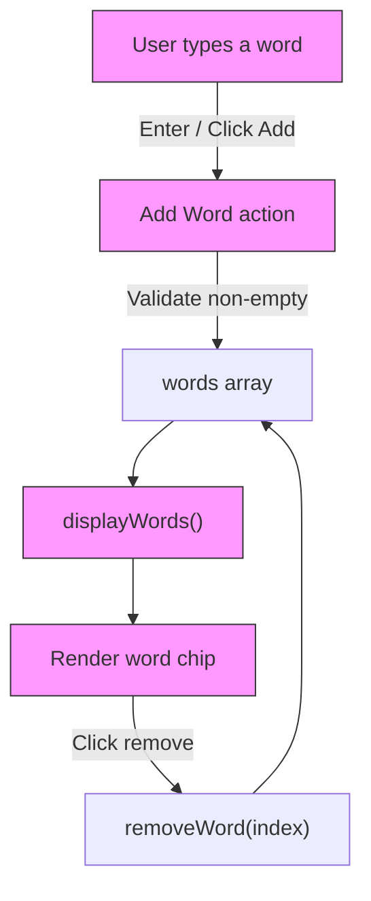

# Add Word — Word Container App

## Project Overview

This is a small, beginner-friendly web app that lets you enter words and display them as visual "chips" inside a word container. It's built with plain HTML, CSS, and JavaScript so you can see the core browser APIs and front-end concepts in a compact example.

What it does:
- Accepts a word from the user input.
- Adds the word to an internal list and renders it as a styled chip in the container.
- Allows removing any word by clicking the × on the chip.

## Files

- [16.5/add word/index.html](16.5/add%20word/index.html) — main HTML structure and elements (input, button, container).
- [16.5/add word/style.css](16.5/add%20word/style.css) — styling for layout, colors, and animations.
- [16.5/add word/script.js](16.5/add%20word/script.js) — application logic (DOM manipulation and event handling).
- [16.5/add word/README.md](16.5/add%20word/README.md) — this file.

## How to run (quick)

1. Open the folder `16.5/add word` in your code editor or file manager.
2. Open `index.html` in a web browser (double-click or right-click → Open with → Browser).
3. Type a word into the input and click "Add Word" or press Enter.

No build tools or servers are required — this is plain static HTML/CSS/JS.

## Concepts covered

- HTML: semantic structure, inputs, buttons, and containers.
- CSS: layout with flexbox, responsive sizing, basic animations, focus states, and visual styling for the chips.
- JavaScript:
	- DOM selection (`getElementById`), element creation (`createElement`), and insertion (`appendChild`).
	- Event handling (`addEventListener`) for clicks and keypresses.
	- Managing internal state with an array to store words.
	- Input validation (ignore empty strings) and focus management.
	- Simple remove operation using `splice` and re-rendering the list.

## Architecture diagram

## How I thought while building this (design & reasoning)

1. Keep it simple and beginner-friendly: use plain HTML/CSS/JS so that each part is visible and editable.
2. UX first: the input should autofocus after adding a word and pressing Enter should work — this makes repeated entry fast.
3. Data model: use a simple array `words` in memory. This keeps the app stateless across page reloads (no persistence), which is fine for the exercise.
4. Rendering strategy: re-render the full list after changes. For this small example, re-creating DOM nodes is simpler and less error-prone than trying to diff nodes.
5. Accessibility & feedback: use placeholder text, focus management, and a small alert when the input is empty to avoid silent failures.
6. Styling: make chips visually distinct and include a remove control that is easy to click.

## Important implementation notes

- The app uses `words.push()` to add words and `words.splice(index, 1)` to remove them, then calls a `displayWords()` function to refresh the UI.
- Buttons and the Enter key both trigger the same `addWord()` function to keep behavior consistent.
- For removing words I chose to pass the index into the remove handler. This is simple and correct for this single-user, in-memory list example.

## Possible next steps / improvements

- Persist words to `localStorage` so the list survives page reloads.
- Prevent duplicate words (dedupe) if that behavior is desired.
- Add trimming/normalization rules (e.g., lowercasing) before storing.
- Improve accessibility: use ARIA attributes on the chips and ensure remove buttons are keyboard reachable.
- Use event delegation to avoid adding inline `onclick` handlers for each chip.
- Add tests (playwright/jest) if this becomes larger.

## Quick debugging tips

- If words do not appear, open the browser DevTools console to look for JavaScript errors.
- Check that `script.js` is loaded (open Network tab or search for script tag in `index.html`).
- Ensure the file paths are not changed; the HTML expects `style.css` and `script.js` in the same folder.

## What I learned / Takeaways

- Small apps are a great place to practice the DOM API and event-driven programming.
- Rendering by recreating DOM nodes is easy to reason about for tiny datasets.
- Good UX details (focus, Enter support, validation) make a tiny utility feel polished.

---

If you want, I can add `localStorage` persistence or show a step-by-step walkthrough in comments inside `script.js` to remind you of the implementation when you return in 6 months.

