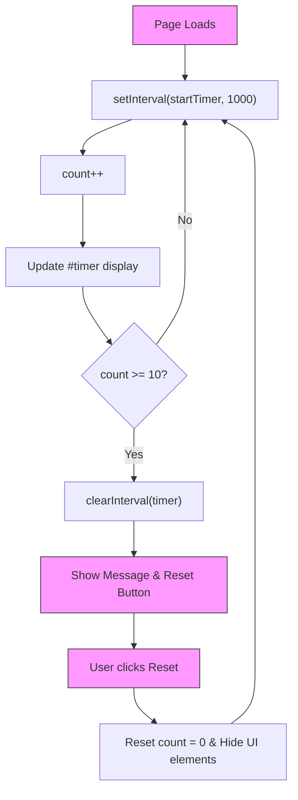

# Session Timer — Simple Timeout App

## Project Overview

This is a small, beginner-friendly web app that implements a session timeout countdown. It demonstrates how to handle time-based events in the browser using JavaScript's timing functions. It's built with plain HTML, CSS, and JavaScript.

What it does:
- Starts a timer that counts up from 0 when the page loads.
- Automatically stops the timer when it reaches 10 seconds.
- Displays a "Session Timeout" message and a "Reset" button once the limit is reached.
- Allows the user to reset the timer and start the process over.

## Files

- [16.5/session-timer/index.html](file:///c:/Users/yashk/Desktop/New%20folder/arc/16.5/session-timer/index.html) — main HTML structure.
- [16.5/session-timer/style.css](file:///c:/Users/yashk/Desktop/New%20folder/arc/16.5/session-timer/style.css) — styling for the timer box and UI elements.
- [16.5/session-timer/script.js](file:///c:/Users/yashk/Desktop/New%20folder/arc/16.5/session-timer/script.js) — timer logic and state management.
- [16.5/session-timer/README.md](file:///c:/Users/yashk/Desktop/New%20folder/arc/16.5/session-timer/README.md) — this file.

## How to run (quick)

1. Open the folder `16.5/session-timer` in your code editor or file manager.
2. Open `index.html` in a web browser.
3. Watch the timer count up to 10 and then click "Reset" to start over.

No build tools or servers are required — this is plain static HTML/CSS/JS.

## Concepts covered

- HTML: basic container structure and element IDs.
- CSS:
    - Centering content with Flexbox.
    - Card-based layout with shadows and rounded corners.
    - Using `display: none` and `display: block/inline-block` for conditional visibility.
- JavaScript:
    - Timing functions: `setInterval` and `clearInterval`.
    - DOM manipulation: updating text content and style properties.
    - Event handling: responding to button clicks.
    - State management: using a simple variable to track time.

## Architecture diagram

## How I thought while building this (design & reasoning)

1. Keep it visual: Using a large font for the timer makes it the focal point of the UI.
2. Minimalist UI: Only show the "Reset" button and "Timeout" message when they are actually needed to reduce visual clutter.
3. Clean logic: Separation of concerns between the timer loop and the reset functionality.
4. User Feedback: Using red color for the timeout message provides immediate visual feedback that the session has ended.

## Important implementation notes

- The app uses `setInterval` to run a function every 1000ms (1 second).
- `clearInterval` is crucial to prevent the timer from running indefinitely in the background after reaching the limit.
- Resetting requires both resetting the numerical state (`count = 0`) and clearing/restarting the interval.

## Possible next steps / improvements

- Add a configurable timeout limit (e.g., let the user type 10, 20, or 30 seconds).
- Add a "Pause" and "Resume" button.
- Implement a "countdown" mode (starting from 10 and going down to 0).
- Play a sound notification when the timeout occurs.
- Persist the last reset time using `localStorage`.

## Quick debugging tips

- If the timer isn't moving, check if `script.js` is correctly linked in `index.html`.
- Use `console.log(count)` inside `startTimer` to verify the interval is firing.
- Check if any CSS rules are accidentally hiding the `#timer` element.

## What I learned / Takeaways

- Working with asynchronous timing in JavaScript requires careful management of interval IDs.
- Conditional visibility in CSS is a simple but powerful way to manage UI states without complex frameworks.
- Small projects like this are perfect for mastering the basics of state-to-UI synchronization.
