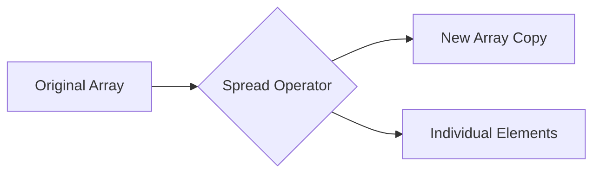

# JS Advanced Concepts — Learning Journal

> A focused exploration of modern JavaScript (ES6+) patterns, focusing on immutability, parameter handling, and the nuances of the Spread and Rest operators.

## Project Overview

This module is a dedicated logic playground designed to master the "Advanced" side of JavaScript. Unlike traditional UI-heavy projects, this repository focuses on the **engine-level behavior** of data structures, function signatures, and memory management (references vs. values). It serves as a foundational guide for writing clean, predictable, and modern JS code.

- **Primary Focus**: Spread Operator, Rest Parameters, Immutability.
- **Entry Point**: [script.js](js-advance/script.js)
- **Key Learning**: Understanding how JavaScript handles data in memory and how to leverage modern syntax to avoid side effects.

## Learning Goals

- Master the **Spread Operator** (`...`) for immutable data updates.
- Distinguish between **Shallow Copying** and **Referencing**.
- Understand **Rest Parameters** for creating flexible, variadic functions.
- Practice the "mental model" of data flow in modern JavaScript.

## JavaScript Logic Flow

The logic in this project is structured as a series of experiments, moving from simple array manipulation to complex object merging and function parameter handling.

### 1. The Spread Operator (`...`)
The spread operator is used to "unpack" elements from an array or object. It's the cornerstone of modern state management (like in React or Redux).



### 2. Copy vs. Reference
A critical distinction for any frontend engineer. Assigning an array to a new variable creates a **reference** (both variables point to the same memory), while spreading creates a **shallow copy**.

| Pattern | Code | Result |
| :--- | :--- | :--- |
| **Reference** | `let arr2 = arr1` | Changes to `arr2` affect `arr1` |
| **Shallow Copy** | `let arr2 = [...arr1]` | `arr2` is a new entity in memory |

## Concepts Learned (Deep Dive)

### The Spread Operator (`...`)
- **What it is**: A syntax that allows an iterable (like an array) to be expanded in places where zero or more arguments or elements are expected.
- **Why it exists**: To replace older, more verbose methods like `concat()` or `apply()`.
- **Problem it solves**: It makes code more readable and simplifies the process of creating copies of data without mutating the original source.
- **Mental Model**: Imagine taking the contents out of a box and placing them into a new, empty box.

### Rest Parameters (`...`)
- **What it is**: A syntax that allows a function to accept an indefinite number of arguments as an array.
- **Why it exists**: To replace the older `arguments` object, which was not a true array and lacked array methods.
- **Problem it solves**: Handling variadic functions (functions that take any number of inputs) gracefully.
- **Mental Model**: The "catch-all" net at the end of a function signature that gathers all remaining items into a single collection.

## Important JavaScript Learnings

### Parameters vs. Arguments
- **Parameters**: The placeholders defined in the function signature (e.g., `function add(a, b)`).
- **Arguments**: The actual values passed to the function when it is called (e.g., `add(5, 10)`).

### The "Undefined" Trap
When passing an array to a function expecting multiple individual parameters (without spreading), the entire array occupies the first parameter, leaving the others `undefined`. This highlights the necessity of the Spread operator in function calls.

```javascript
function addTwoNumbers(a, b) {
    console.log(a + b);
}
let nums = [1, 2];
addTwoNumbers(nums); // Result: "1,2undefined" (Array + undefined)
addTwoNumbers(...nums); // Result: 3 (1 + 2)
```

## Folder Structure Explained

```text
25.5/
└── js-advance/
    ├── index.html   # Entry point (Placeholder for UI experiments)
    └── script.js    # Core logic and advanced concept implementations
```

## Step-by-Step Development Journey

1. **Started with Basics**: Initialized the project to test simple array spreading.
2. **Memory Analysis**: Explored the difference between reference assignments and actual copies.
3. **Object Mastery**: Applied spreading to objects to learn how to update specific properties while maintaining the rest of the state.
4. **Function Flexibility**: Implemented Rest parameters to see how functions can handle dynamic inputs.

## Future Improvements

- **UI Visualization**: Build a DOM-based dashboard to visualize array/object changes in real-time.
- **Performance Benchmarking**: Compare the performance of `Spread` vs. `Array.from()` vs. `concat()` for large datasets.
- **Deep Copy Implementation**: Explore the limitations of shallow copying and implement a deep copy utility using `structuredClone()` or JSON methods.

## Personal Notes
This project was a "lightbulb moment" for understanding why my data was sometimes changing unexpectedly in other projects. Learning that `let a = b` doesn't actually create a new list is a fundamental step toward mastering state management.

---
*This README was generated as part of a technical documentation exercise, focusing on advanced JavaScript concepts.*
