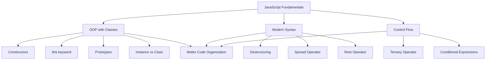

# 26.5 — Advanced JavaScript Concepts & Syntax 🚀

> **Lesson Focus:** Mastering ES6+ features, OOP fundamentals, and modern JavaScript syntax patterns.
> 
> **Status:** Learning checkpoint for intermediate JavaScript concepts
> 
> **Last Updated:** 2026

---

## 📋 Project Overview

**26.5** is a **concept-focused learning collection** that explores three critical JavaScript topics essential for modern frontend development:

1. **Object-Oriented Programming (OOP)** — Classes, constructors, and the `this` keyword
2. **ES6 Destructuring & Spread/Rest Operators** — Modern syntax for cleaner array/object handling
3. **Ternary Operators** — Conditional logic in compact form

Each sub-project is a **practical code example** demonstrating real-world usage patterns, not just theoretical syntax.

---

## 🎯 Learning Goals

| Concept | Goal | Why It Matters |
|---------|------|---|
| **Classes & OOP** | Understand blueprint-based object creation | Foundation for scalable, maintainable code |
| **`this` keyword** | Master context binding in methods | Essential for method invocation and state management |
| **Destructuring** | Extract values from arrays/objects elegantly | Reduces boilerplate, improves code readability |
| **Spread/Rest** | Expand/collect array elements dynamically | Critical for function parameters and array manipulation |
| **Ternary Operator** | Write concise conditional expressions | Clean alternative to if/else for simple conditions |

---

## 📁 Folder Structure Explained

```
26.5/
├── README.md (this file)
├── oops/
│   └── script.js (Class definitions, constructors, this keyword, prototypes)
├── spread-rest-array/
│   ├── index.html (Empty wrapper for console execution)
│   └── script.js (Destructuring, spread/rest operators)
└── ternary-operator/
    └── script.js (Ternary conditional operator)
```

Each subfolder is **self-contained** and can be run independently in the browser console or Node.js environment.

---

## 🔍 Deep Dive: Project Breakdown

### 1️⃣ OOP (`oops/script.js`) — Classes & Object Creation

#### What It Teaches

This project contrasts **two approaches** to object creation in JavaScript:

**❌ The "Noob Way" (Object Literals)**
```javascript
let johnAcc = {
    name: "john",
    age: 30,
    deposit: function(balance) {
        this.balance += balance;
    }
}
```

**Problems:**
- No blueprint for creating multiple similar objects
- Verbose and repetitive
- Hard to manage when you need 100 accounts
- No inheritance mechanism
- Mixing data and methods in one definition

---

**✅ The Proper Way (ES6 Classes)**
```javascript
class BankAccount {
    constructor(name, age, accNo, balance) {
        this.name = name;
        this.age = age;
        this.accNo = accNo;
        this.balance = balance;
    }
    deposit(balance) {
        this.balance += balance;
    }
}

let samAcc = new BankAccount("sam", 30, 1234567890, 1000);
```

**Benefits:**
- 🏗️ Single blueprint for multiple objects
- 📦 Encapsulation of related data and methods
- 🔧 Constructor runs automatically on instantiation
- 🌱 Foundation for inheritance
- 📜 Clear, readable code structure

#### Key Concepts Explored

**1. Constructor Function**
```javascript
constructor(name, age, accNo, balance) {
    // Runs when: new BankAccount(...) is called
    // Initializes instance properties
    this.name = name;
}
```

The constructor is **special** because:
- It executes automatically when you use `new` keyword
- It's where you initialize instance-specific properties
- Each instance gets its own copy of these properties
- `this` inside constructor refers to the newly created object

**2. The `this` Keyword — Mental Model**

```javascript
let samAcc = new BankAccount("sam", 30, 1234567890, 1000);
samAcc.deposit(500);
```

Inside the `deposit()` method:
- `this` = the object that called the method (samAcc)
- `this.balance` = samAcc's balance specifically
- Without `this`, JavaScript wouldn't know which account to update

**Visual Flow:**
```
BankAccount class (blueprint)
         ↓
    new BankAccount()
         ↓
samAcc (instance with its own properties)
         ↓
samAcc.deposit() calls method
         ↓
inside method, this = samAcc
```

**3. Prototype Chain Investigation**

```javascript
console.log(BankAccount.prototype)
console.log(Object.getPrototypeOf(samAcc))
```

**Why this matters:**
- Every object has a prototype (the template it inherits from)
- `BankAccount.prototype` = the template for all BankAccount instances
- `Object.getPrototypeOf(samAcc)` = retrieving samAcc's prototype directly
- Methods defined in the class live on the prototype, not in each instance (memory efficient!)

**JavaScript's Prototype Chain:**
```
samAcc (instance)
   ↓ [[Prototype]]
BankAccount.prototype (methods like deposit)
   ↓ [[Prototype]]
Object.prototype (shared methods: toString, hasOwnProperty, etc.)
   ↓ [[Prototype]]
null (end of chain)
```

#### Real-World Application

This pattern is fundamental to frameworks like React:
- React components use classes (or functions with hooks)
- Each component has its own state (`this` context)
- Methods update that state without affecting other instances
- Same structure, different data = scalability

---

### 2️⃣ Spread/Rest & Destructuring (`spread-rest-array/`)

#### What It Teaches

Modern JavaScript syntax for **elegantly handling collections**.

#### Concept 1: Rest Operator in Array Destructuring

```javascript
let arr = [1, 2, 3, 4, 5, 6, 7, 8, 9, 10]
let [a, b, c, ...rest] = arr;

console.log(a)     // 1 (first element)
console.log(b)     // 2 (second element)  
console.log(c)     // 3 (third element)
console.log(rest)  // [4, 5, 6, 7, 8, 9, 10] (remaining elements as array)
```

**Why this is powerful:**
- ✨ Extract specific values without writing arr[0], arr[1], etc.
- 🎁 Collect remaining elements into a single variable
- 📝 Makes intent clear and code more readable
- 🚀 Reduces need for manual array slicing

**Mental Model:**
```
Original Array:    [1, 2, 3, 4, 5, 6, 7, 8, 9, 10]
                    ↓  ↓  ↓  ↓↓↓↓↓↓↓↓↓↓↓↓↓↓↓
Assigned to:       a  b  c  ...rest

Result:
a = 1
b = 2
c = 3
rest = [4, 5, 6, 7, 8, 9, 10]
```

---

#### Concept 2: Object Destructuring

```javascript
let obj = { name: "john", age: 30, status: "active" }
let { name, status } = obj;

console.log(name)    // "john"
console.log(status)  // "active"
```

**What's happening:**
- Extract `name` and `status` properties from the object
- Create new variables with those exact names
- Ignore properties we don't need (like `age`)

**Comparison — The Old Way vs. Modern Way:**

| Old Way | Modern Way |
|---------|-----------|
| `let name = obj.name` | `let { name } = obj` |
| `let status = obj.status` | `let { status } = obj` |
| 3 lines | 1 line |
| Verbose | Clear intent |

---

#### Real-World Usage Patterns

**In React Components:**
```javascript
// Destructuring props
function UserCard({ name, age, status }) {
    // Instead of: function UserCard(props) { const name = props.name; ... }
    return <h1>{name}</h1>
}
```

**In API Responses:**
```javascript
const { userId, userName, email } = apiResponse;
// Extract only what you need from a large response object
```

**In Function Parameters:**
```javascript
function calculatePrice([basePrice, ...taxes]) {
    return basePrice + taxes.reduce((a, b) => a + b, 0);
}
```

---

### 3️⃣ Ternary Operator (`ternary-operator/script.js`)

#### What It Teaches

Compact conditional logic for **inline decision-making**.

```javascript
2 > 3 ? console.log("2 is greater than 3") : console.log("2 is not greater than 3");
// Output: "2 is not greater than 3"
```

#### Syntax Structure

```
condition ? valueIfTrue : valueIfFalse
```

**Visual Breakdown:**
```
    2 > 3
       ↓ (evaluates to false)
      false
       ↓
    ternary looks for the : part
       ↓
   valueIfFalse
       ↓
console.log("2 is not greater than 3")
```

#### When to Use

**✅ Good Use Cases:**
```javascript
// Assign different values
const status = age >= 18 ? "adult" : "minor";

// Return different values
return count > 0 ? "items available" : "out of stock";

// Quick if/else in JSX
<h1>{isLoading ? "Loading..." : "Content"}</h1>
```

**❌ Poor Use Cases:**
```javascript
// ❌ Don't nest too deeply
status = x > y ? a : b > c ? d : e > f ? g : h; // Unreadable

// ❌ Don't use for complex logic
// ❌ Use regular if/else instead
```

#### Mental Model: Decision Tree

```
Question: 2 > 3?
         ↓
      NO (false)
         ↓
    Execute: console.log("2 is not greater than 3")
```

**vs. if/else equivalent:**
```javascript
if (2 > 3) {
    console.log("2 is greater than 3");
} else {
    console.log("2 is not greater than 3");
}
```

The ternary is **shorter but** should only be used when the logic is simple and obvious.

---

## 🧠 Key JavaScript Concepts Reinforced

### 1. Object-Oriented Thinking

**Before understanding classes:**
- Objects seemed like just collections of properties
- No clear pattern for creating multiple similar objects
- Confusion about what "blueprint" means in programming

**After understanding classes:**
- Objects are instances of a template
- Each instance has its own state
- Methods operate on that instance's data
- Scalable mental model for large applications

### 2. Context & `this` Binding

**The Problem:** In traditional functions, `this` can be unpredictable:
```javascript
let samAcc = { balance: 1000, add: function() { this.balance += 100 } }
let add = samAcc.add;  // Extract method
add();  // this = undefined or window (depending on strict mode)
```

**In Classes (simplified):**
- Methods in classes have stable `this` context
- `this` always refers to the instance
- More predictable behavior

### 3. Modern Syntax = Cleaner Code

**Rest operator removes the need for:**
- Manual array slicing: `arr.slice(3)`
- Tracking arguments: `arguments` object
- Verbose destructuring loops

**Example:**
```javascript
// Old way
function sum(a, b, c) {
    let rest = Array.prototype.slice.call(arguments, 3);
    // ... process rest manually
}

// Modern way
function sum(a, b, c, ...rest) {
    // rest is already an array, ready to use
}
```

### 4. Readability vs. Conciseness

JavaScript allows multiple ways to do the same thing:

| Task | Old Way | Modern Way |
|------|---------|-----------|
| Extract properties | `let n = obj.name; let a = obj.age;` | `let { name: n, age: a } = obj;` |
| Collect extra params | Track `arguments` | Use `...rest` |
| Simple conditional | `if (x) { return y } else { return z }` | `return x ? y : z` |

**Learning Goal:** Choose the approach that makes your code **most readable for future-you**.

---

## 🛠️ Execution & Testing

### Running Each Project

**In Browser Console:**
1. Open `spread-rest-array/index.html` in a browser
2. Open DevTools (F12)
3. Console shows output from each script

**In Node.js:**
```bash
node oops/script.js
node spread-rest-array/script.js
node ternary-operator/script.js
```

**Expected Outputs:**

| File | Output |
|------|--------|
| `oops/script.js` | `1000` → `2000` → prototype objects logged |
| `spread-rest-array/script.js` | `1 2 3 [4, 5, 6, 7, 8, 9, 10]` and `john active` |
| `ternary-operator/script.js` | Logs `"2 is not greater than 3"` |

---

## 📚 Concepts Learned Summary



---

## 🔗 Mental Model Diagrams

### Class Instantiation Flow

```
┌─────────────────────────────────────────────────────┐
│            CLASS DEFINITION                         │
│  class BankAccount {                                │
│    constructor(name, accNo, balance) { ... }       │
│    deposit(amount) { ... }                         │
│  }                                                  │
└─────────────────────────────────────────────────────┘
                      ↓
            new BankAccount(...)
                      ↓
┌─────────────────────────────────────────────────────┐
│            INSTANCE CREATED                         │
│  samAcc = {                                         │
│    name: "sam",        // own properties            │
│    accNo: 12345,                                    │
│    balance: 1000,                                   │
│    [[Prototype]]: BankAccount.prototype             │
│  }                                                  │
└─────────────────────────────────────────────────────┘
```

### Destructuring Assignment Flow

```
Original Data:
┌────────────────────────────────┐
│ [1, 2, 3, 4, 5, 6, 7, 8, 9, 10] │
└────────────────────────────────┘
         ↓
    Pattern: [a, b, c, ...rest]
         ↓
    Match & Extract:
    ┌──┬──┬──┬─────────────────────┐
    │a │b │c │       rest          │
    │1 │2 │3 │[4,5,6,7,8,9,10]    │
    └──┴──┴──┴─────────────────────┘
```

---

## 💡 Important Learnings & Patterns

### Pattern 1: Blueprint vs. Instance

**Don't Confuse:**
- `BankAccount` = the blueprint (class)
- `samAcc` = the actual object (instance)
- Changes to `samAcc` don't affect `BankAccount`
- Multiple instances can exist from one blueprint

```javascript
let samAcc = new BankAccount("sam", 30, 123, 1000);
let janeAcc = new BankAccount("jane", 28, 456, 5000);

samAcc.deposit(100);  // Only samAcc changes
console.log(samAcc.balance);  // 1100
console.log(janeAcc.balance); // 5000 (unchanged)
```

### Pattern 2: Methods Share, Properties Don't

**Memory Efficient:**
```javascript
// ❌ Each instance would copy the method (wasteful)
class BankAccount {
    deposit = function(balance) { this.balance += balance; }
}

// ✅ All instances share the same method (efficient)
class BankAccount {
    deposit(balance) { this.balance += balance; }
}
```

The method lives on the prototype, saving memory when you have thousands of instances.

### Pattern 3: Destructuring = Intent Declaration

```javascript
// ❌ Unclear what you need from this object
let user = getData();
let name = user.name;
let status = user.status;

// ✅ Clear: you only need name and status
let { name, status } = getData();
```

Readers immediately know what this code cares about.

### Pattern 4: Choose the Right Tool

```javascript
// Ternary for simple one-line decisions
const message = isReady ? "Go!" : "Wait";

// if/else for complex logic
if (isReady && hasResources && isConnected) {
    doSomething();
    doAnotherThing();
    handleResults();
} else {
    showErrorDialog();
    logFailure();
    retryLater();
}
```

---

## 🎓 Before vs. After Understanding

### Class & `this` Keyword

| Before | After |
|--------|-------|
| "How do I create multiple similar objects?" | "I use a class as a blueprint, then create instances with `new`" |
| "`this` is confusing and unpredictable" | "`this` refers to the object the method is called on (in classes, it's stable)" |
| "What's a prototype?" | "The template that instances inherit from; it's where shared methods live" |
| "How do I manage related data and functions?" | "Group them in a class: data as properties, logic as methods" |

### Destructuring

| Before | After |
|--------|-------|
| "Why would I need this?" | "It extracts values and makes code intent clearer with less boilerplate" |
| "How does spread `...` work?" | "It expands an array/collects remaining elements, depending on context" |
| "I have to do `obj.name` and `obj.age`?" | "Just use `let { name, age } = obj;` — one line, same result" |

### Ternary Operator

| Before | After |
|--------|-------|
| "When should I use this?" | "For simple conditions you can read left-to-right. Use if/else for complex logic" |
| "Is it shorter code?" | "Yes, but readability matters more than shortness" |

---

## 🚀 Performance & Optimization Notes

### Classes Are Memory Efficient

```javascript
// If you create 10,000 BankAccount instances:
// - Each gets its own: name, age, accNo, balance (properties)
// - All share: the deposit() method (on prototype)
// Result: 1 copy of deposit() × 10,000 instances = saved memory
```

### Destructuring Has No Runtime Cost

```javascript
let { name, status } = obj;
// This is syntactic sugar that compiles to:
// let name = obj.name;
// let status = obj.status;
// Same performance, better readability
```

---

## 🔮 Next Steps & Future Improvements

### Concepts to Explore Next

1. **Inheritance** — Extend classes to create specialized versions
   ```javascript
   class SavingsAccount extends BankAccount {
       interestRate = 0.02;
       addInterest() { /* ... */ }
   }
   ```

2. **Static Methods** — Methods on the class itself, not instances
   ```javascript
   static fromJSON(json) { /* deserialize */ }
   ```

3. **Getters & Setters** — Control property access
   ```javascript
   get balance() { return this._balance; }
   set balance(amount) { /* validate */ this._balance = amount; }
   ```

4. **Spread in Function Calls** — Expand arrays as arguments
   ```javascript
   Math.max(...arr);  // Instead of Math.max.apply(null, arr)
   ```

5. **Array Methods with Destructuring**
   ```javascript
   const [first, ...others] = array.filter(x => x > 5);
   ```

### Refactoring Ideas for OOP Example

```javascript
// Add validation
class BankAccount {
    constructor(name, age, accNo, balance) {
        if (balance < 0) throw new Error("Balance cannot be negative");
        this.name = name;
        this.age = age;
        this.accNo = accNo;
        this.balance = balance;
    }
    
    // Add more methods
    withdraw(amount) {
        if (amount > this.balance) throw new Error("Insufficient funds");
        this.balance -= amount;
    }
    
    getBalance() {
        return this.balance;
    }
}
```

---

## 📝 Personal Notes & Insights

### What "Clicked" About Classes

The big realization: **A class is just a template.** When you write:

```javascript
class BankAccount { ... }
```

...you're not creating an object yet. You're creating a *recipe* for creating objects. Every time you do `new BankAccount()`, you follow that recipe to build a new, independent object.

This is the same mental model as:
- A LEGO instruction booklet (class) vs. a LEGO creation (instance)
- A cookie cutter (class) vs. individual cookies (instances)
- A blueprint (class) vs. actual buildings (instances)

### What "Clicked" About `this`

`this` = "the object I'm inside right now"

```javascript
samAcc.deposit(500);  // Inside deposit(), this = samAcc
janeAcc.deposit(200); // Inside deposit(), this = janeAcc
```

Without `this`, the method wouldn't know *which* account to update. `this` is the connection between the method and its owner object.

### Why Modern Syntax Matters

JavaScript in 2026 vs. 10 years ago:
- ES6+ features like destructuring, rest/spread, classes make code **intentional**
- Less boilerplate means more focus on logic
- Easier for other developers (and future-you) to understand quickly

The goal isn't to be clever with syntax—it's to write code that *clearly expresses intent*.

---

## 📚 Resources & Concepts for Deep Dives

### Class & OOP Concepts
- **this keyword**: Refers to the calling context; in classes, it's the instance
- **Prototypes**: Every object has a prototype chain for method/property lookup
- **Constructor**: Special method that initializes an instance
- **Instance vs. Static**: Instance methods act on individual objects; static methods act on the class itself

### ES6+ Syntax
- **Destructuring**: Pattern matching to extract values from arrays/objects
- **Rest Operator (`...`)**: Collects remaining elements into an array
- **Spread Operator (`...`)**: Expands elements of an array
- **Template Literals**: Backticks for cleaner string interpolation

### Control Flow
- **Ternary Operator**: `condition ? trueValue : falseValue` — inline conditional
- **Short-circuit Evaluation**: `&&` and `||` operators for logical shortcuts
- **Switch Statements**: When ternary/if-else gets too complex

---

## 🎯 How to Use This Folder Going Forward

1. **Review the code regularly** — Return to this folder when you need a refresher on OOP, destructuring, or ternary operators
2. **Practice variations** — Modify the BankAccount class to add new methods or properties
3. **Create your own examples** — Build a `Product` class or `Cart` class using these patterns
4. **Reference this README** — When you forget how rest operator works, come back here for the mental model
5. **Notice patterns in real code** — Look for these concepts in frameworks like React, Vue, or library code

---

## ✨ Summary

**26.5 teaches the foundation of modern JavaScript:**

- 🏗️ **Classes & OOP** = How to organize code at scale
- 🎁 **Destructuring & Spread/Rest** = How to work with collections elegantly
- ⚡ **Ternary Operator** = How to write concise conditions

These aren't just syntax tricks—they're **patterns that make you think differently about code structure, readability, and scalability**.

---

*Happy learning! May your objects be well-structured and your destructuring be elegant.* 🚀

