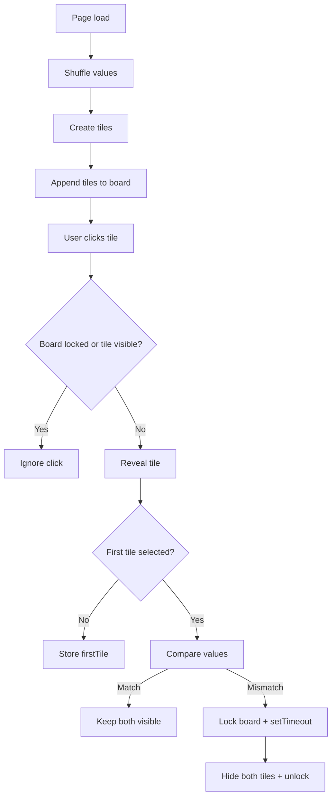

# Memory Game

## Project Overview

This is a browser-based memory matching game implemented with plain HTML, CSS, and JavaScript. The app builds a 4x4 board of concealed tiles, reveals them on click, and checks for matches between pairs. The game is intentionally small and educational: it demonstrates dynamic DOM creation, basic game state handling, click control, and timing with `setTimeout()`.

---

## Features

- 16 tiles arranged in a 4x4 grid
- 8 matching pairs of numbers
- board generated dynamically in JavaScript
- per-tile click handlers
- match detection and conceal logic
- click locking to prevent invalid input during mismatch resolution

---

## Learning Goals

- Practice DOM manipulation with `createElement()` and `appendChild()`
- Use `dataset` to attach metadata to DOM nodes
- Control UI state through CSS classes
- Build simple game logic with state variables
- Learn timing and asynchronous behavior with `setTimeout()`
- Understand the importance of click locking in interactive UI

---

## Tech Stack

- HTML
- CSS
- JavaScript

No frameworks, no build tools, no external assets.

---

## Folder Structure Explained

```text
memory-game/
  ├─ index.html
  ├─ style.css
  ├─ script.js
  └─ README.md
```

- index.html: app shell and entry point
- style.css: layout and visual hiding of tiles
- script.js: game creation, event handling, and match logic

---

## UI Preview Explanation

The UI consists of:

- a `main` container
- a title `h1`
- an empty `.tiles-container` placeholder

The board is rendered entirely with JavaScript. Each tile is a `div.tile.hidden` containing a number. The `.hidden` class controls whether the tile value is visible or concealed.

---

## DOM Structure Breakdown

The rendered DOM becomes:

```html
<main>
  <h1>Memory Game</h1>
  <div class="tiles-container">
    <div class="tile hidden" data-value="5">5</div>
    <div class="tile hidden" data-value="2">2</div>
    ...
  </div>
</main>
```

Key elements:

- `.tiles-container`: grid wrapper
- `.tile`: tile component
- `.hidden`: tile is face-down
- `data-value`: stored match value

---

## JavaScript Logic Flow

The logic is driven entirely from script.js:

1. Select the board container:
   - `document.querySelector(".tiles-container")`
2. Create an array of paired values:
   - `[1,1,2,2,3,3,4,4,5,5,6,6,7,7,8,8]`
3. Shuffle values:
   - `values.sort(() => Math.random() - 0.5)`
4. Build tiles:
   - `document.createElement("div")`
   - add classes and metadata
   - attach `click` listener
5. Append each tile to `.tiles-container`
6. On click:
   - ignore if the board is locked
   - ignore if the tile is already revealed
   - reveal tile by removing `.hidden`
   - if first selection, save reference
   - if second selection, compare values
   - if match: leave tiles revealed
   - if mismatch: lock board and hide both after 1 second

### Game state variables

- `firstTile`
  - remembers the first selected tile
- `lockBoard`
  - prevents clicks while a mismatch is being resolved

---

## Event Handling Flow

This app uses per-tile event listeners, not delegation.

Each tile gets:

```js
tile.addEventListener("click", () => {
  ...
});
```

The click flow uses these checks:

- `if (lockBoard || !tile.classList.contains("hidden")) return`
  - stops extra interactions
- `tile.classList.remove("hidden")`
  - reveals the clicked tile
- if `firstTile` is empty, store this tile
- if `firstTile` exists, compare `dataset.value`:
  - same => keep both revealed
  - different => re-hide after delay

Mermaid diagram:



---

## State Management Approach

This project uses simple state variables rather than complex models:

- `firstTile`
  - holds the first open tile in a pair cycle
- `lockBoard`
  - acts as a guard against invalid user behavior

Why it exists:

- to prevent selecting more than two tiles during mismatch resolution
- to avoid comparing a partially selected third tile
- to preserve deterministic game flow

Mental model:

- `firstTile` is “I’m waiting on the other half of the pair”
- `lockBoard` is “temporarily freeze input while the board catches up”

---

## Timing/Event Loop Concepts

The only asynchronous behavior is:

```js
setTimeout(() => { ... }, 1000);
```

What it does:

- keeps both mismatched tiles visible for one second
- gives players time to see the second chosen tile
- delays hiding and unlocks the board afterward

Why it exists:

- without it, mismatches would disappear instantly
- without `lockBoard`, the user could click more tiles before the timeout ends

Browser event loop note:

- `setTimeout` schedules a callback to run later
- the browser continues handling user input until the callback executes
- `lockBoard` prevents new clicks from affecting the current mismatch state

---

## CSS Techniques Used

Key layout/style decisions:

- `.tiles-container` uses CSS Grid:
  - `display: grid`
  - `grid-template-columns: repeat(4, 100px)`
  - `gap: 10px`
- `.tile` uses Flexbox for centering:
  - `display: flex`
  - `justify-content: center`
  - `align-items: center`
- `.tile.hidden` hides content with:
  - `background: #0051a1`
  - `color: transparent`

Why it exists:

- grid makes the board explicit and regular
- fixed tile sizes keep the board predictable
- hidden state is purely a CSS class toggle

Performance note:

- use of classes is cheap and browser-friendly
- no CSS transitions means immediate state changes

---

## Browser APIs Used

- `document.querySelector()`
  - selects the board container
- `document.createElement()`
  - creates tile elements on the fly
- `Element.classList`
  - toggles visible/hidden state
- `Element.dataset`
  - stores the tile’s numeric value
- `Node.appendChild()`
  - renders the tile into the DOM
- `EventTarget.addEventListener()`
  - wires click interactions
- `setTimeout()`
  - delays the mismatch flip-back

---

## Component / UI Architecture

This app uses a tiny component model:

- `tiles-container` is the board
- each `.tile` is one game cell
- game state lives outside the DOM, but tile identity is stored in `data-value`

The board is not prebuilt in HTML — the app bootstraps it in JS, so the DOM is a runtime representation of the game state.

---

## Accessibility Considerations

What exists:

- semantic `main` wrapper
- clear page title in `h1`
- visible numeric content inside each tile

What is missing:

- keyboard interaction
- ARIA labels or button semantics
- focus management
- screen-reader friendly hidden state

Opportunity:

- replace `.tile` divs with real buttons
- add `aria-pressed`, `aria-label`, and keyboard controls
- use `role="grid"`/`role="gridcell"` if staying with divs

---

## Challenges Faced

### Click handling during mismatch
- solved by `lockBoard`
- prevents the user from clicking a third tile before the timeout finishes

### Duplicate tile selection
- solved by `if (!tile.classList.contains("hidden")) return`
- prevents matching a tile with itself or re-clicking a revealed tile

### Shuffle quality
- current shuffle uses `sort(() => Math.random() - 0.5)`
- works for learning, but a true Fisher–Yates shuffle would be more correct

---

## Bugs & Debugging Journey

Common bug patterns in this game:

- rapid repeated clicks corrupting match logic
- the same tile becoming the first and second choice
- board state not resetting after a mismatch

How the code solves them:

- `lockBoard` prevents extra clicks
- `firstTile = null` resets after both match and mismatch
- `.hidden` check prevents visible tile selection

---

## Future Improvements

- add a restart / reset button
- add a “moves” counter or timer
- show a completion message when all pairs are matched
- replace `sort()` shuffle with Fisher–Yates
- add CSS flip or fade transitions
- add keyboard navigation and accessibility roles
- make layout responsive for smaller screens
- persist high score or best time with `localStorage`

---

## Personal Notes

This project is a good lesson in how tiny state machines and DOM manipulation combine to create interaction. The biggest takeaway is that games are often about:

- modeling state clearly
- using UI classes to reflect that state
- preventing invalid user input
- letting the browser handle painting while your logic pauses with timers

It is a compact exercise in frontend thinking and a strong foundation for more advanced interactive UI work.