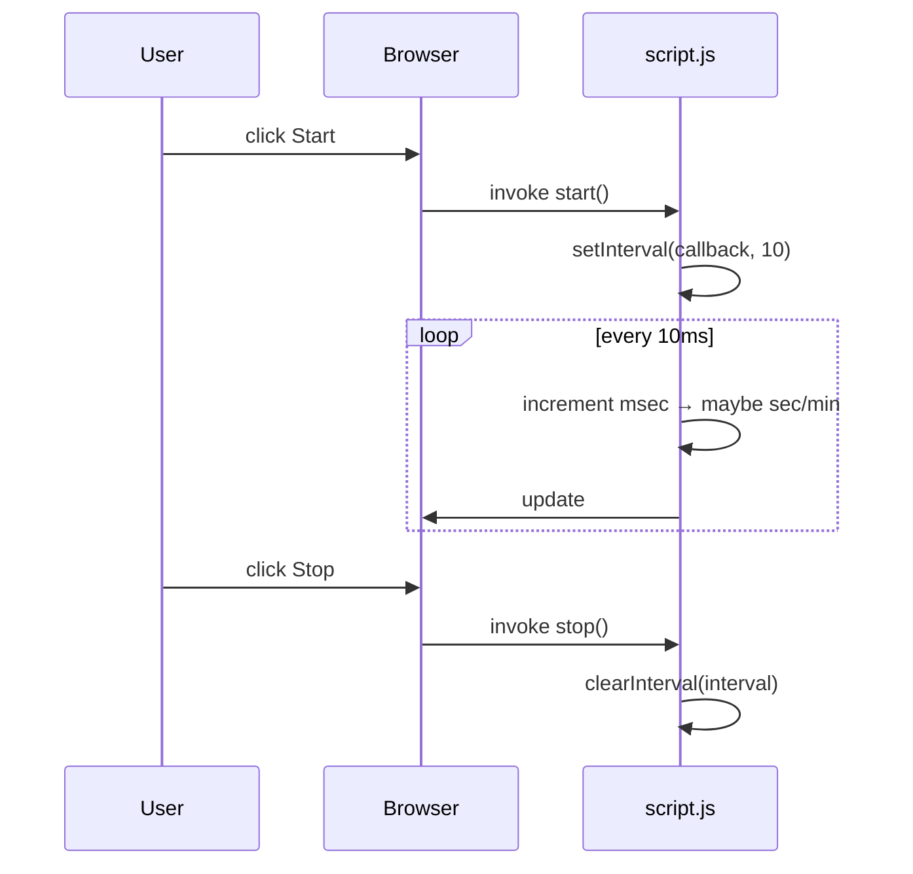

# Stopwatch — Learning Journal

> A compact, vanilla-JavaScript stopwatch designed as a learning exercise in DOM manipulation, timing, and UI state management.

## Project Overview

- What it is: a minimal stopwatch that tracks minutes, seconds, and centiseconds (hundredths of a second). The UI exposes `Start`, `Stop`, and `Reset` controls and a large time display.
- Where to look: [stopwatch/index.html](stopwatch/index.html#L1-L24), [stopwatch/script.js](stopwatch/script.js#L1-L200), [stopwatch/style.css](stopwatch/style.css#L1-L200)

## Features

- Start, stop, and reset a running timer.
- Time formatted as `MM:SS:CS` (minutes:seconds:centiseconds).
- Lightweight, dependency-free implementation focused on learning browser timing and DOM APIs.

## Learning Goals

- Understand `setInterval` / `clearInterval` and timing accuracy trade-offs.
- Practice DOM selection and update patterns with `querySelector` and `textContent`.
- Learn simple UI state handling without frameworks.
- Explore layout and typography with minimal CSS.

## UI Preview Explanation

- The app renders a single time display (`#time`) and a button group. The buttons map directly to functions in `script.js`:
	- `Start` → `start()`
	- `Stop` → `stop()`
	- `Reset` → `reset()`

## Tech Stack

- Plain HTML5, CSS3, and vanilla JavaScript (ES6+).
- No build tools or dependencies — ideal for small experiments and learning.

## Folder Structure Explained

```
stopwatch/
	├─ index.html       # markup and UI skeleton
	├─ style.css        # visual layout and spacing
	└─ script.js        # stopwatch logic and event handlers
```

## DOM Structure Breakdown

- Root container: `main` holds the time display and the `.btn-container`.
- Time element: `p#time` — single source of truth for the visible timer string.
- Controls: three `button` elements with `id`s `start`, `stop`, `reset`.

See the markup in [stopwatch/index.html](stopwatch/index.html#L1-L24).

## JavaScript Logic Flow

- Primary state variables:
	- `min`, `sec`, `msec` — numeric counters for minutes, seconds, and centiseconds.
	- `interval` — holds the ID returned by `setInterval`.

- Main functions:
	- `start()` — creates an interval with `setInterval(..., 10)` that increments `msec` every 10ms, rolls over to seconds/minutes, and writes a padded string into `#time`.
	- `stop()` — calls `clearInterval(interval)` to pause the counting loop.
	- `reset()` — clears the interval, zeroes the counters, and resets the UI to `00:00:00`.

Code entrypoints and listeners are in the final lines of [stopwatch/script.js](stopwatch/script.js#L1-L200).

### Why this counter uses `msec` up to 100

- The implementation increments `msec` on each 10ms tick. When `msec` reaches 100, it rolls over to seconds. That means `msec` represents centiseconds (hundredths of a second). This is a common, human-friendly display granularity that avoids showing raw milliseconds while remaining precise enough for a stopwatch.

## Event Handling Flow

1. User clicks a button.
2. Event listener attached via `addEventListener('click', fn)` invokes the corresponding function.
3. `start()` registers `setInterval` (if not already running) which updates numeric state and the DOM.
4. `stop()`/`reset()` clear the interval, updating state/UI accordingly.

Mermaid sequence diagram of the click -> update flow:



## Application Workflow (step-by-step)

1. Page loads — static HTML and CSS render the UI.
2. Script loads and registers event listeners for the three control buttons.
3. When `Start` is pressed, a 10ms interval begins updating counters and the DOM.
4. `Stop` pauses (keeps current values) by clearing the interval.
5. `Reset` clears the interval and sets all counters to zero.

## Step-by-Step Development Journey (notes you can refer back to)

- Start small: use a single `p#time` string as the UI contract — simple single source of truth.
- Prefer descriptive variable names (`min`, `sec`, `msec`, `interval`) over compact one-letter names for clarity.
- Use `textContent` rather than `innerHTML` for performance and security when writing plain text.

## Important JavaScript Learnings (explained with the why/problem/mental-model pattern)

- setInterval / clearInterval
	- What: a browser timer API that repeatedly runs a callback after a fixed delay.
	- Why used: to create a regular heartbeat that advances time counters.
	- Problem solved: scheduling repeated work without manually re-calling functions.
	- Mental model: think of `setInterval` as a repeating alarm; `clearInterval` is silencing it. However, alarms can drift — they are not precise clocks.

- Counting with rollovers
	- What: increment a small unit (`msec`) and roll up into `sec` and `min` when thresholds are met.
	- Why used: simple arithmetic yields readable units and bounds each counter.
	- Problem solved: converting a stream of small ticks into human-friendly time units.
	- Mental model: counters are odometers; when the right-most wheel completes a cycle, it increments the next wheel.

- DOM selection & mutation
	- What: `document.querySelector('#time')` and `textContent` updates.
	- Why used: minimal, direct manipulation for tight learning feedback loop.
	- Problem solved: connect program state to visible UI efficiently.
	- Mental model: JS owns the state; DOM is the view. Write only the string you need.

## CSS Techniques Used

- Centering with Flexbox: `body` uses `display:flex` and `align-items`/`justify-content` to center content vertically and horizontally — simple and robust.
- Vertical stacking with `flex-direction: column` plus `gap` for consistent spacing.
- Scalable typography: the time display uses a large `font-size` and `font-weight: bold` for readability.

## Responsive Design Notes

- The design is effectively responsive because it uses flexible centering and relative font sizing; there are no fixed-width containers.
- For very small viewports you might want to reduce `#time` font-size via a media query. This is left intentionally simple for the exercise.

## Browser APIs Used

- `setInterval`, `clearInterval` — timing APIs.
- `document.querySelector` — DOM traversal.
- `Element.textContent` — DOM mutation.

## Timing / Event Loop Concepts

- The code calls `setInterval` with `10` ms, aiming to tick every ten milliseconds. In reality, the browser's event loop, timer clamping, and tab throttling can make this imprecise.
- Practical implications:
	- Short intervals (10ms) increase CPU wakeups and are more susceptible to drift.
	- For highly accurate timing (e.g., race timers), avoid relying solely on `setInterval`. Instead, compute elapsed time from `performance.now()` and render based on that.

### Alternative (more accurate) mental model

- Use a reference timestamp: on `start()` store `t0 = performance.now()` and on each animation frame compute `elapsed = performance.now() - t0` and derive `min:sec:cs` from `elapsed`.

## State Management Approach

- Primitive local state variables (`min`, `sec`, `msec`, `interval`) live in the module scope — straightforward for a single-widget app.
- Single source of truth: the code composes a formatted string and writes it to `#time` on each tick — the view reflects the state directly.

## Component / UI Architecture

- Flat and explicit: the stopwatch is a single component. Controls directly mutate global module state.
- This is intentionally simple for pedagogy; a next step would be to encapsulate the stopwatch as a class or component factory.

## Accessibility Considerations

- The current implementation uses semantic `button` elements which are keyboard-focusable and screen-reader friendly by default.
- Improvements:
	- Add `aria-pressed` or `aria-live="polite"` on the time display to announce updates to assistive tech.
	- Ensure `Start` becomes `disabled` while running (or toggle to `Pause`) to reduce confusing controls.

## Challenges Faced & Bugs — What You Would Expect

- Timer drift: `setInterval` with 10ms is not guaranteed to be precise. Expect small errors over long runs.
- Multiple starts: clicking `Start` repeatedly will create multiple intervals (and speed up counting). A robust solution guards against concurrent intervals by checking `interval` before starting.

## Key Breakthrough Moments

- Realizing `msec` is centiseconds (0–99) simplified the UI and math: you only need three counters and two rollover thresholds.
- Choosing `textContent` over `innerHTML` for safer, faster DOM updates.

## Before vs After Understanding

- Before: timers feel magical and 'ticks' are confusing.
- After: `setInterval` is a repeating callback that can drift; accurate timers require timestamps and diff calculations.

## Performance Notes

- Keep UI updates minimal — only the formatted time string is updated, which is efficient.
- For longer-running or multiple timers, consider using `requestAnimationFrame` or computing display values from a single, authoritative timestamp to avoid drift and reduce CPU load.

## Future Improvements

- Prevent multiple `start()` calls from registering duplicate intervals.
- Replace the tick-based counter with an elapsed-time approach using `performance.now()`.
- Add lap recording and storage via `localStorage`.
- Add keyboard shortcuts (Space to start/stop, R to reset).

## Personal Notes

- This project is a focused exercise in timing and DOM updates. Keep it small — the educational payoff is in noticing subtle timing and UX edge cases.

## References & Resources

- MDN `setInterval`: https://developer.mozilla.org/en-US/docs/Web/API/WindowOrWorkerGlobalScope/setInterval
- MDN `performance.now()`: https://developer.mozilla.org/en-US/docs/Web/API/Performance/now
- Event loop visualizations and timer clamping articles for deeper timing accuracy understanding.

