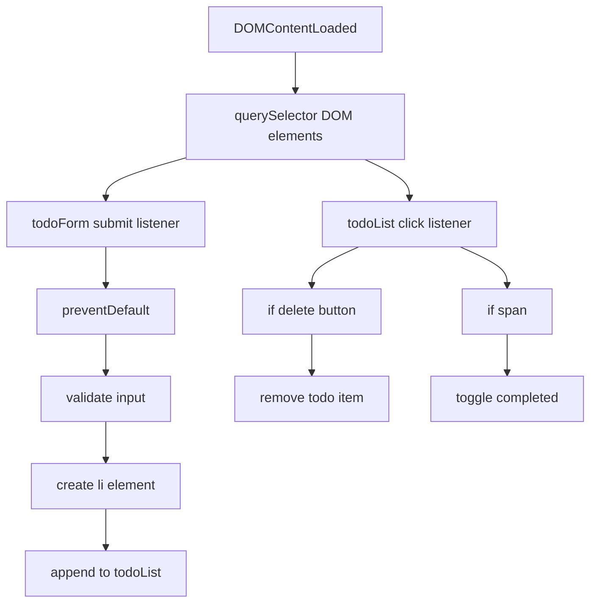

# Todo App — Learning Journal

## Project Overview

This is a simple browser-based Todo App built with plain HTML, CSS, and JavaScript. It demonstrates the classic frontend learning pattern for creating an interactive list:

- create todos
- render them in the DOM
- mark items as completed
- delete items

The app is intentionally small, making it a good training ground for DOM manipulation, event handling, and UI structure without a framework.

---

## What I Built

The app consists of:

- index.html — page structure and form
- style.css — layout, spacing, buttons, and list styling
- script.js — event-driven todo creation, deletion, and completion toggling

It is a single-page experience where the main interaction is handled in the browser through JavaScript.

---

## Features

- Add todo items using a form
- Render todos dynamically as `<li>` elements
- Mark todos complete by clicking the text
- Delete todos using a button
- Basic responsive layout with centered card-style UI

---

## Folder Structure Explained

```
todo-app/
  index.html
  style.css
  script.js
  README.md
```

This is a minimal project layout, which makes the app easy to inspect and extend. All behavior lives in script.js, presentation is in style.css, and the HTML provides a clear semantic structure.

---

## UI Preview Explanation

The app UI is a centered card with:

- a page title
- a text input
- a submit button
- an unordered list for todo items

The visual hierarchy is simple:

- `main` as the app wrapper
- `form` for adding new todos
- `ul` for the todo list

CSS sets the card width, background, and spacing, giving the app a clean, focused look.

---

## DOM Structure Breakdown

The rendered DOM is small and deliberate:

- `body`
  - `main`
    - `h1`
    - `form#todo-form`
      - `input#todo-input`
      - `button[type=submit]`
    - `ul#todo-list`
      - generated `li`
        - `span`
        - `button.delete-btn`

### DOM Structure Diagram

```mermaid
flowchart TB
  A[main]
  A --> B[h1]
  A --> C[form#todo-form]
  C --> D[input#todo-input]
  C --> E[button[type=submit]]
  A --> F[ul#todo-list]
  F --> G[li]
  G --> H[span]
  G --> I[button.delete-btn]
```

This structure supports a clear separation between input controls and rendered todo items.

---

## HTML Structure

The HTML uses:

- `<!DOCTYPE html>` for standards mode
- `lang="en"` for accessibility and localization
- `meta viewport` to support mobile scaling
- semantic elements like `main`, `form`, `ul`, `li`, `button`

The todo input is required, so the browser prevents empty submissions at the HTML level before JavaScript runs.

---

## CSS Architecture

CSS follows a simple component structure:

- page wrapper styles for `body` and `main`
- typography for `h1`
- layout for `#todo-form`
- styling for input, submit button, list, list items, delete button
- hover states for buttons

### Key CSS Patterns

- `display: flex` on the form for horizontal alignment
- `max-width` and `margin: 0 auto` for centered content
- button color contrast and hover feedback
- list item spacing with `border-bottom`

This is a beginner-friendly layout that still uses real frontend best-practice ideas: container centering, responsive input widths, and interactive button states.

---

## JavaScript Logic Flow

The app logic is centered around two flows:

1. Creating a todo item
2. Interacting with existing todos

### Initialization

```js
document.addEventListener('DOMContentLoaded', () => { ... });
```

This ensures the script runs only after the DOM is ready. It is a lightweight equivalent of waiting for page load without blocking UI rendering.

### Main variables

- `todoForm`
- `todoInput`
- `todoList`
- `savedTodos`

`todoForm`, `todoInput`, and `todoList` are cached DOM references. `savedTodos` is an array that currently collects text values but is not persisted.

### Submit flow

- `submit` event listener on form
- `e.preventDefault()` prevents page refresh
- `todoInput.value.trim()` sanitizes whitespace
- `document.createElement('li')` builds list item
- `innerHTML` creates the internal structure
- `todoList.appendChild(todoItem)` renders it
- `todoInput.value = ''` resets the input
- `savedTodos.push(todoText)` updates runtime state

### Interaction flow

A single `click` listener is added to the list container for event delegation:

- clicking `.delete-btn` removes the parent `li`
- clicking a `SPAN` toggles `completed` class

This is a powerful beginner/intermediate pattern because it avoids adding many per-item listeners and keeps logic centralized.

---

## Event Handling Flow



### Why event delegation exists here

Instead of attaching a click handler to every generated delete button and todo text, the code listens on `ul#todo-list` and inspects `e.target`. This solves:

- dynamic item creation
- lower memory overhead
- simpler event wiring

---

## State Management Approach

The app uses a simple in-memory state array:

- `const savedTodos = []`

This array is updated when a todo is added, but it is not used to re-render the list, and it is not stored in `localStorage`. That means the "application state" exists only until the page reloads.

### State lesson

This is a good example of the gap between:

- UI state in DOM
- app state in JavaScript

The DOM is the source of truth for the visible todos, but the developer has started to keep a parallel JS state array. That is an important learning step for moving toward more advanced state-driven design.

---

## Browser APIs Used

- `document.getElementById()` for element selection
- `document.createElement()` for element creation
- `Element.classList.toggle()` for visual toggling
- `Event.preventDefault()` to stop form submit navigation
- `Node.appendChild()` for DOM insertion
- `Node.removeChild()` for removals
- `DOMContentLoaded` lifecycle event

These are core DOM APIs used in almost every vanilla JavaScript project.

---

## Accessibility Considerations

Positive points:

- semantic `form` and input
- `button` elements are used for clickable actions
- the todo text is inside a `span`, which is simple and clear

Areas for improvement:

- add `aria-label` to the delete button for screen readers
- use `label` for the input field to improve form accessibility
- add keyboard interaction for completing todos
- add focus styles for keyboard users

---

## CSS Techniques Used

- card-style centered layout with `max-width`
- mobile-friendly `width: 70%` input
- flexbox on the form and list item
- hover states for buttons
- border separators for list items

This is a practical CSS pattern for small apps where the main design challenge is spacing and clear interaction affordances.

---

## Concepts Learned

### DOM manipulation

- selecting elements by ID
- creating elements dynamically
- updating inner HTML
- appending children

### Event-driven programming

- handling `submit` events
- handling click events on dynamic content
- using event delegation

### Clean UI interaction

- `preventDefault` to override browser behavior
- `trim()` to avoid blank todos
- resetting inputs after submit

### Runtime state

- storing todo text in a JS array
- recognizing the difference between DOM state and JS state

### CSS layout basics

- flexbox for horizontal alignment
- button styling for affordance
- container centering and spacing

---

## Challenges Faced & Debugging Journey

### Likely challenges

- preventing the page refresh on form submit
- ensuring newly added todos appear immediately
- deleting dynamically generated items
- toggling completed state without extra event listeners

### Debugging patterns

- put `console.log` inside the submit handler to verify input values
- inspect generated HTML in browser devtools
- test click delegation by checking `e.target.classList`

### Real issue discovered

`const savedTodos = []` is currently unused for rendering persistence. That is a meaningful debugging and architectural lesson: if you create state, you must either use it to generate the UI or persist it.

---

## Key Breakthrough Moments

- realizing that event delegation simplifies dynamic item handling
- understanding that `preventDefault()` keeps single-page behavior intact
- using `classList.toggle()` to separate visual state logic from data logic
- recognizing the difference between app data arrays and actual rendered list items

---

## Future Improvements

This project is a great baseline. The next upgrades should include:

- persist todos with `localStorage`
- restore todos on page load
- wire `savedTodos` into rendering logic
- add edit functionality
- add item counts and filters
- improve accessibility with labels and ARIA
- add keyboard support for delete/complete actions
- animate todo additions and deletions
- avoid `innerHTML` in favor of safer element creation

---

## Personal Notes

This app reads like a beginner-to-intermediate frontend exercise that demonstrates a lean but effective architecture.

The developer is practicing:

- practical DOM APIs
- lightweight event-driven UI
- the mental model that "the page is a live document, not just static HTML"
- using CSS to make UI feel like a simple web app

This README should help me remember:
- how the form submits are handled
- how todos are created and removed
- why event delegation is better for generated elements
- where the app state currently lives
- where persistence should be added next

---

## Summary

This is a neat learning project that captures the core JavaScript todo-app workflow:

- create
- render
- interact
- delete

It also exposes the first real architecture question for a frontend learner: how to connect runtime state (`savedTodos`) with visible DOM state and persistence. That is exactly the next step this project should evolve into.